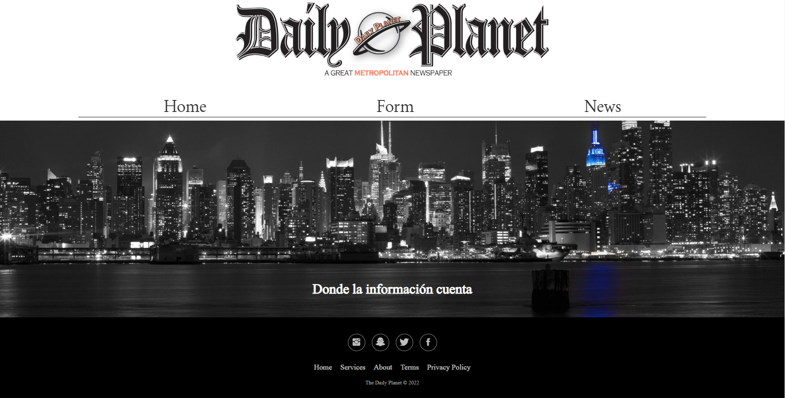

#  <center> 📰 React News Page 📰</center> 

 ## 📑 Indice 

 - [Sobre el proyecto](#sobre-el-proyecto)

    - [Instalación y despliegue](#instalacion-y-despliegue)

    - [Tecnologías utilizadas](#tecnologias-utilizadas)
    
- [Requerimientos](#requerimientos)

- [Estructura de la página](#estructura-de-la-pagina)

- [Documentacion de React](#documentacion-de-react)

- [Rutas](#rutas)

- [Retos presentados](#retos-presentados)

- [Agradecimientos](#agradecimientos)

- [Futura implementaciones](#futuras-implementaciones)

- [Autor](#autor)

<br>

# Sobre el proyecto 🙇‍♀️

##  Instalación y despliegue 🤖

<br>

Primero instalamos react con la carpeta que contendrá el proyecto

```
npx create-react-app nombre-aplicacion	 
```

<br>

Una buena idea es instalar esta extensión para acceder a los snippets de React
```
https://marketplace.visualstudio.com/items?itemName=dsznajder.es7-react-js-snippets
```

<br>

La siguiente herramienta de desarrollador nos permite ver las jerarquías de los componentes de React

```
https://chrome.google.com/webstore/detail/react-developer-tools/fmkadmapgofadoplj
bjfkapdkoienihi?hl=es
```

<br>

Deberemos installar el siguiente paquete para poder crear rutas en nuestros componentes

```
$ npm install react-router-dom@6
```

<br>

Instalamos el paquete sass para aplicar reglas anidadas y funciones con variables entre otras cosas

```
$ npm install sass

```
<br>

## Tecnologías utilizadas ⛏️

- HTML
- CSS
- Sass
- Javascript
- React
- React-GlobalContext
- React-Router

<br>

# Requerimientos 🦂

* Un mini-proyecto de React para practicar todos los elementos básicos de React ya vistos.
* Implementar una "web de noticias"
* Uso de [NYT News API](https://developer.nytimes.com/apis).
* Uso del router React
* Utilizar componentes anidados (cabecera, home, pie de página, formulario, lista de noticias).
* Utilizar React Context
* Utilizar SASS

<br><br>

## Estructura de la página 🏗️

Cada ruta construye una página con tres componentes: La cabecera y el pie de página son comunes a
todas ellas. La Cabecera tiene tres botones, con `<Link />`, para acceder a las
tres rutas.

<br><br>

# Rutas


**Home** `/`
* Se compone de un Hero
* Un navbar
* Una imagen central
* Un footer

<br>




# Documentación de React 👓

https://es.reactjs.org/docs/getting-started.html

<br>

# Retos presentados 💢

El mayor reto fue detectar por qué, al mapear el array de objetos obtenido de la API, no siempre mostraba las noticias deseadas. Lo que ocurría era que habían objetos que no tenían imagen y eso hacía que el resto no se pintara. Una vez descubierto el problema se tuvo que programar una condición para que, al detectar un objeto sin imagen, la declarara null.


<br>

# Agradecimientos 🤝


Agradecimientos a Sofía, Ger e Iván por su inestimable ayuda para sacar adelante el proyecto. 

Gracias a Mike por compartir su saber en css y la programación.
Gracias a Xavi por aguantar que lo saque de su concentración para resolver mis dudas en tiempo récord.
Gracias a Vanesa por iluminarme con el LocalStorage y entender un poco mejor todo lo relacionado al globalcontext de React.


<br>

# Futuras implementaciones 🚀


- Añadir más estados


<br>

# Autor 🐧

Germán Molero

- https://github.com/Molerog